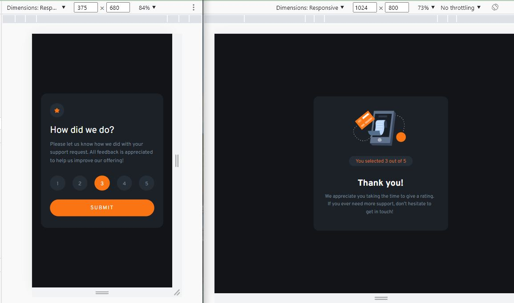

# Frontend Mentor - Interactive rating component solution

This is a solution to the [Interactive rating component challenge on Frontend Mentor](https://www.frontendmentor.io/challenges/interactive-rating-component-koxpeBUmI). 

## Table of contents

- [Overview](#overview)
  - [The challenge](#the-challenge)
  - [Screenshot](#screenshot)
  - [Links](#links)
- [My process](#my-process)
  - [Workflow](#workflow)
  - [Built with](#built-with)
  - [What I learned](#what-i-learned)
  - [Continued development](#continued-development)
  - [Useful resources](#useful-resources)
- [Author](#author)
- [Acknowledgments](#acknowledgments)

## Overview

### The challenge

Users should be able to:

- View the optimal layout for the app depending on their device's screen size
- See hover states for all interactive elements on the page
- Select and submit a number rating
- See the "Thank you" card state after submitting a rating

### Screenshot

### Links

- Solution: [frontendmentor.io](https://www.frontendmentor.io/solutions/interactive-rating-component-QfEaEmAGnB)
- Live Site: [netlify.app](https://intractive-rating.netlify.app/)

## My process

### Workflow

- Preparing workflow (Installing React, Adding assets, Prepating README.md)

- Identifying and creating components
  - RateInput, RateResult

- Working on mobile design based on `design` folder and `style-guide.md` file

- Working on desktop desing based on `design` folder and `style-guide.md` file

- Adding Rate component to manage rating functionality and common styles 

- Working on React functionality

- Completing README.md

- Publish on github.com | nelify.app | frontmentor.io

### Built with

- [React](https://reactjs.org/)
- [CSS modules](https://create-react-app.dev/docs/adding-a-css-modules-stylesheet) - For styles
- Mobile-first workflow
- Semantic HTML5 markup
- CSS custom properties
- Flexbox

### What I learned

React functionality was tricky, passing data and events to children and getting data from them was the point of this challenge

### Continued development

Read more React and some day I must read React animation libraries

### Useful resources

- [cooler.co](https://coolors.co/) - I used this site to generate a color between 2 colors

## Author

- github - [@siavhnz](https://www.your-site.com)

- Frontend Mentor - [@siavhnz](https://www.frontendmentor.io/profile/siavhnz)

## Acknowledgments

Thanks To

[Fuji](https://stackoverflow.com/users/418400/fuji) for this answer to creating [range](https://stackoverflow.com/a/10050831/3925013) in javascript 

[Frontendmentor.io](https://www.frontendmentor.io/challenges) - for their Excitement challenges  

[Perfect Pixel](https://chrome.google.com/webstore/detail/perfectpixel-by-welldonec/dkaagdgjmgdmbnecmcefdhjekcoceebi?hl=en) - for such a great extension

